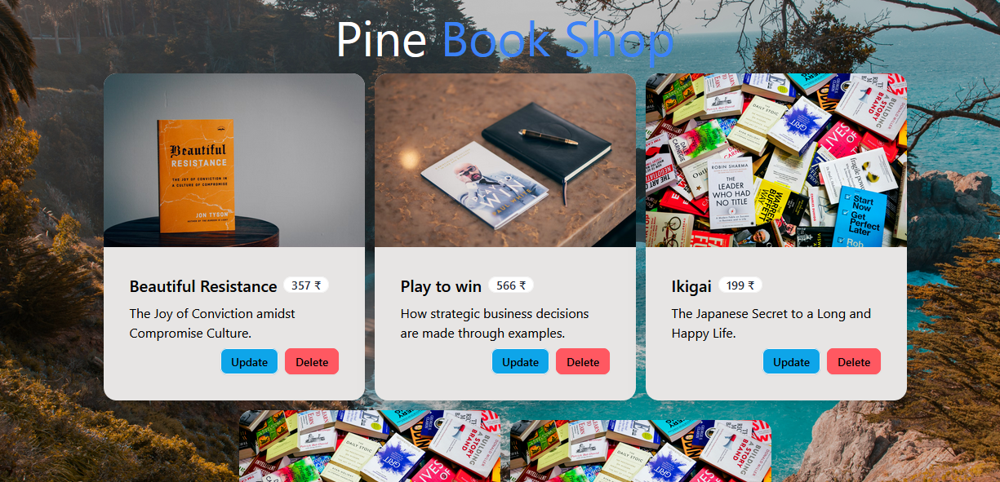

## 📚 Book Shop

Welcome to Book Shop! Manage your book collection effortlessly with React.js, Node.js, Express.js, and MySQL. Create, update, and delete books seamlessly with full CRUD functionality. React.js ensures a responsive UI, while Node.js and Express.js power the backend. MySQL stores your data reliably. Dive into Book Shop and revolutionize your book management experience! 🚀📖

## Frontend
- The frontend part is in the client file.
- The client side is built on Vite+React.
- The frontend is deployed on Netlify .

### Tools Used:
- tailwindcss 
- daisyui
- react-router-dom
- react-hot-toast
- axios

## Backend 
- The backend part is in the server file.
- The server API is built on NodeJS and MySql.
- The server API is deployed on Render.

### Tools Used:
- cors
- dotenv
- express
- mysql2
- nodemon

## How to setup the project on local system 💻:
- Clone this project to your local system.
- For client and server files individually follow the bellow steps.
- Run `npm install` to install required dependencies.
- Run `npm start` to start the server app.
- Run `npm run dev` to start the client app.
- Create MySql database and connect with the app.
